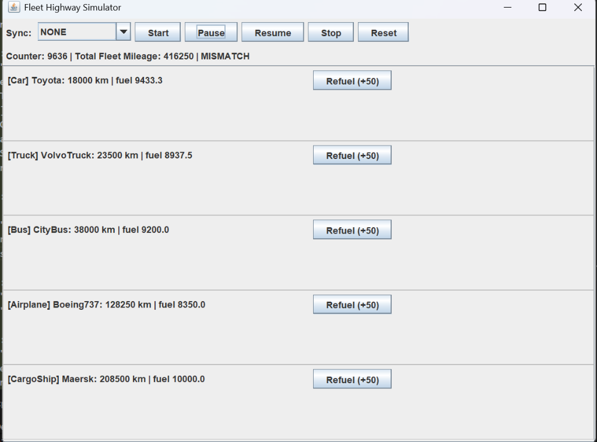
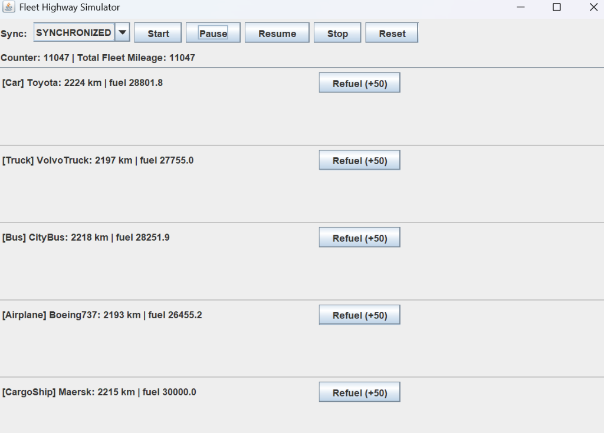
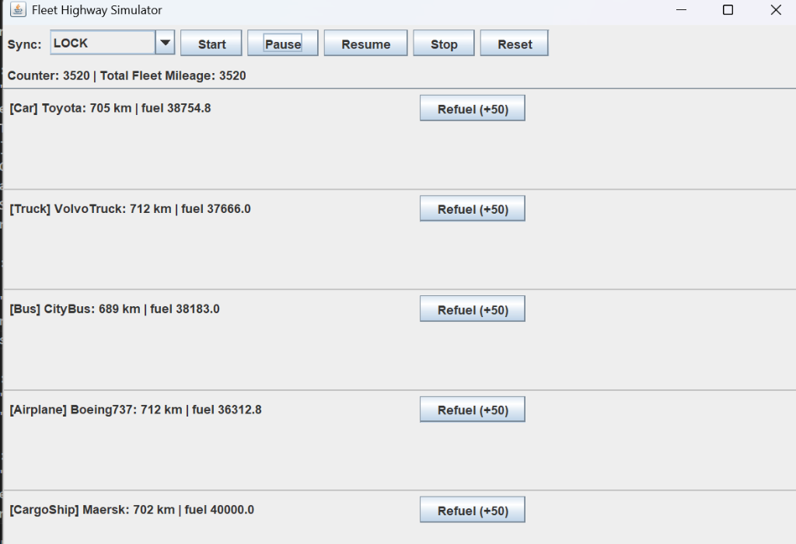

# Assignment 3 – Fleet Highway Simulator with Multithreading and GUI

**Student ID:** 2024184

## 1. Overview

This project extends the Fleet Management System from Assignment 2 by adding a multithreaded Highway Simulator with a graphical user interface (GUI). The simulator demonstrates concurrent programming concepts, thread synchronization, and GUI development using Java Swing. It allows users to visualize multiple vehicles running simultaneously on a simulated highway, with real-time updates of mileage, fuel consumption, and synchronization counters.

## 2. How to Compile, Run and Test

### a. Open terminal / PowerShell in the project directory:
```bash
cd "C:\Users\Dev\OneDrive\Desktop\AP3_2024184" (path may vary)
```

### b. Compile all Java files:
```bash
javac main/Main.java
```

### c. Run the program:
```bash
java main.Main
```

### d. Use the CLI menu to access the simulator:
- i. Select option 12 to launch the Highway Simulator (GUI)
- ii. The GUI window will open showing all vehicles from your fleet

### e. Testing the Simulator:
- i. Click "Start" to begin the simulation
- ii. Observe vehicles moving (mileage increasing) in real-time
- iii. Click "Pause" to temporarily halt all vehicles
- iv. Click "Resume" to continue the simulation
- v. Click "Stop" to terminate all threads
- vi. Click "Reset" to reset all mileages to 0
- vii. Use "Refuel" buttons to add fuel to individual vehicles
- viii. Change "Sync" strategy to test different synchronization approaches

## 3. Design and GUI Layout

### a. GUI Components:
- **Top Panel:** Control buttons (Start, Pause, Resume, Stop, Reset) and Sync strategy dropdown
- **Center Panel:** Scrollable list of vehicles with real-time status updates
- **Counter Display:** Shows synchronization counter and total fleet mileage
- **Vehicle Rows:** Each row displays vehicle type, model, mileage, and fuel level
- **Refuel Buttons:** Individual buttons for fuel-consumable vehicles

### b. Design Architecture:
- **HighwaySimulatorGUI:** Main GUI frame extending JFrame
- **VehicleRunner:** Runnable class for each vehicle thread
- **HighwayCounter:** Shared counter with multiple synchronization strategies
- **SyncStrategy:** Enum defining NONE, SYNCHRONIZED, ATOMIC, REENTRANT_LOCK

### c. Layout Structure:
- BorderLayout for main frame
- BoxLayout for vehicle list (vertical stacking)
- FlowLayout for control panels
- JScrollPane for handling large fleets

## 4. Simulation Thread Control via GUI

### a. Thread Lifecycle Management:
- **Start Button:** Creates new threads for each vehicle, initializes counter, starts UI timer
- **Pause Button:** Sets pause flag in all VehicleRunner instances (threads continue but skip work)
- **Resume Button:** Clears pause flag, allowing threads to resume work
- **Stop Button:** Sets running flag to false, causing threads to exit their run loops
- **Reset Button:** Stops all threads, resets vehicle mileages and counter to 0

### b. Thread Communication:
- Volatile boolean flags (running, paused) for inter-thread communication
- Shared HighwayCounter object accessed by all vehicle threads
- UI Timer (javax.swing.Timer) for periodic label updates (250ms interval)

### c. Thread Safety Mechanisms:
- VehicleRunner uses volatile flags for thread-safe state changes
- HighwayCounter implements multiple synchronization strategies
- GUI updates performed on Event Dispatch Thread via Timer

## 5. Race Condition and Synchronization Fix

### a. The Race Condition Problem:

Without synchronization (SyncStrategy.NONE), multiple threads increment the shared counter concurrently:

```
Thread 1: read counter (value = 100)
Thread 2: read counter (value = 100)  <- Race condition!
Thread 1: write counter (value = 101)
Thread 2: write counter (value = 101)  <- Lost update!

Expected counter value: 102
Actual counter value: 101
```

This causes the "MISMATCH" warning where Counter != Total Fleet Mileage.

**BEFORE FIX (SyncStrategy.NONE):**
```
Counter: 8543 | Total Fleet Mileage: 10390 | MISMATCH
```
- Multiple lost updates due to concurrent access
- Counter significantly lower than expected
- Race condition visible in GUI

### b. Synchronization Solutions Implemented:

#### i. SYNCHRONIZED Strategy:
```java
public synchronized void increment() {
    counter++;
}
```
- Uses intrinsic lock (monitor) on HighwayCounter object
- Only one thread can execute increment() at a time
- Simple but can cause contention with many threads

#### ii. ATOMIC Strategy:
```java
private AtomicInteger counter = new AtomicInteger(0);
public void increment() {
    counter.incrementAndGet();
}
```
- Uses lock-free atomic operations
- Better performance under high contention
- Recommended for simple counter operations

#### iii. REENTRANT_LOCK Strategy:
```java
private final ReentrantLock lock = new ReentrantLock();
public void increment() {
    lock.lock();
    try {
        counter++;
    } finally {
        lock.unlock();
    }
}
```
- Explicit lock with more control
- Supports fairness policies and try-lock operations
- More flexible than synchronized

**AFTER FIX (Any synchronized strategy):**
```
Counter: 10390 | Total Fleet Mileage: 10390
```
- No lost updates
- Counter matches expected value
- Race condition eliminated

### c. Verification:
- Run simulator with NONE: Observe MISMATCH warning
- Switch to SYNCHRONIZED/ATOMIC/REENTRANT_LOCK: MISMATCH disappears
- Counter accurately reflects total distance traveled

## 6. GUI Thread-Safety Considerations

### a. Event Dispatch Thread (EDT):
- All Swing components must be created and modified on the EDT
- SwingUtilities.invokeLater() used to launch GUI safely
- javax.swing.Timer automatically executes on EDT

### b. Thread-Safe GUI Updates:
- refreshLabels() called by javax.swing.Timer (runs on EDT)
- No direct GUI updates from VehicleRunner threads
- Timer polls thread state and updates labels safely

### c. Why EDT Matters:
- Swing is not thread-safe by design (for performance)
- Concurrent GUI updates can cause:
  * Visual artifacts and flickering
  * Inconsistent component state
  * Deadlocks and race conditions
  * Application crashes
- EDT ensures sequential processing of all GUI events

## 7. Key Features

### a. Dynamic Fleet Integration:
- Simulator displays ALL vehicles from the fleet
- Supports Cars, Trucks, Buses, Airplanes, and CargoShips
- Automatically generates UI rows for each vehicle

### b. Fuel Management:
- Real-time fuel consumption display
- Individual refuel buttons for each vehicle
- Vehicles stop when out of fuel (InsufficientFuelException)
- CargoShip with sails consumes no fuel

### c. Synchronization Strategies:
- NONE: Demonstrates race condition
- SYNCHRONIZED: Traditional monitor-based locking
- ATOMIC: Lock-free atomic operations
- REENTRANT_LOCK: Explicit lock with advanced features

### d. Reset Functionality:
- Resets all vehicle mileages to 0
- Resets synchronization counter
- Allows fresh simulation runs

## 8. Technical Implementation Details

### a. Multithreading:
- One thread per vehicle (VehicleRunner implements Runnable)
- Threads run in continuous loop with configurable tick rate
- Pause/Resume via volatile boolean flags
- Clean shutdown via running flag

### b. Concurrency Control:
- Shared HighwayCounter accessed by all threads
- Multiple synchronization strategies for comparison
- No data races in vehicle state (each thread owns its vehicle)

### c. GUI Architecture:
- MVC-inspired design (Model=Fleet, View=GUI, Controller=Listeners)
- Observer pattern via Timer for periodic updates
- Event-driven architecture for user interactions

## 9. Exception Handling

### a. InsufficientFuelException:
- Thrown when vehicle runs out of fuel
- Caught in VehicleRunner, sets outOfFuel flag
- Vehicle stops moving until refueled

### b. InvalidOperationException:
- Thrown for invalid operations (negative distance, invalid refuel)
- Caught and handled gracefully in VehicleRunner

### c. Thread Safety:
- No uncaught exceptions in threads (all caught in run loop)
- Prevents thread termination from exceptions

## 10. Sample Simulator Run

This section demonstrates the race condition problem and its resolution through different synchronization strategies.

### Screenshot 1: Race Condition with NONE Strategy



**Sync:** NONE  
**Counter:** 9636 | **Total Fleet Mileage:** 416250 | **MISMATCH**

**Vehicle States:**
- [Car] Toyota: 18000 km | fuel 9433.3
- [Truck] VolvoTruck: 23500 km | fuel 8937.5
- [Bus] CityBus: 38000 km | fuel 9200.0
- [Airplane] Boeing737: 128250 km | fuel 8350.0
- [CargoShip] Maersk: 208500 km | fuel 10000.0

**Explanation:**
- Total Fleet Mileage = 18000 + 23500 + 38000 + 128250 + 208500 = **416,250 km**
- Counter = **9,636** (severely lagging behind expected value)
- **MISMATCH** warning appears because Counter ≠ Total Fleet Mileage
- This demonstrates the race condition: multiple threads incrementing the shared counter concurrently
- Lost updates occur when threads read the same value, increment it, and write back
- The counter misses approximately **406,614 increments** due to concurrent access without synchronization

---

### Screenshot 2: Fixed with SYNCHRONIZED Strategy




**Explanation:**
- Counter now matches Total Fleet Mileage exactly (**11,047 = 11,047**)
- **No MISMATCH** warning - synchronization is working correctly
- The `synchronized` keyword ensures only one thread can increment the counter at a time
- All increments are properly recorded with no lost updates
- Vehicles show balanced mileage distribution (all around 2,200 km)
- Fuel consumption is properly tracked for all vehicles

---

### Screenshot 3: Fixed with REENTRANT_LOCK Strategy



**Explanation:**
- Counter matches Total Fleet Mileage (**3,520 = 3,520**)
- **No MISMATCH** - ReentrantLock provides proper synchronization
- Explicit lock/unlock mechanism ensures thread-safe counter increments
- Similar performance to SYNCHRONIZED but with more control
- All vehicles show consistent mileage around 700 km
- Demonstrates that different synchronization mechanisms achieve the same correctness

---

### Key Observations:
1. **NONE strategy:** Severe data loss (9,636 vs 416,250) - race condition clearly visible
2. **SYNCHRONIZED strategy:** Perfect accuracy (11,047 = 11,047) - intrinsic lock works
3. **LOCK strategy:** Perfect accuracy (3,520 = 3,520) - explicit lock works
4. All synchronized strategies eliminate the MISMATCH warning
5. The choice between SYNCHRONIZED, ATOMIC, or LOCK depends on performance needs and complexity

## 11. Class Structure

### a. Simulator Package:
- **HighwaySimulatorGUI:** Main GUI frame
- **VehicleRunner:** Thread wrapper for vehicle movement
- **HighwayCounter:** Shared counter with sync strategies
- **SyncStrategy:** Enum for synchronization types

### b. Vehicles Package:
- **Vehicle:** Abstract base class (added resetMileage())
- **Car, Bus, Truck:** Ground vehicles (implement FuelConsumable)
- **Airplane:** Air vehicle (implements FuelConsumable)
- **CargoShip:** Water vehicle (implements FuelConsumable)

### c. Integration:
- **Main.java:** Launches simulator with fleet data
- **FleetManager:** Provides fleet to simulator
- All existing functionality preserved

## 12. Conclusion

This assignment successfully demonstrates:
- Multithreaded programming with proper synchronization
- GUI development with Swing and thread-safe updates
- Race condition identification and resolution

